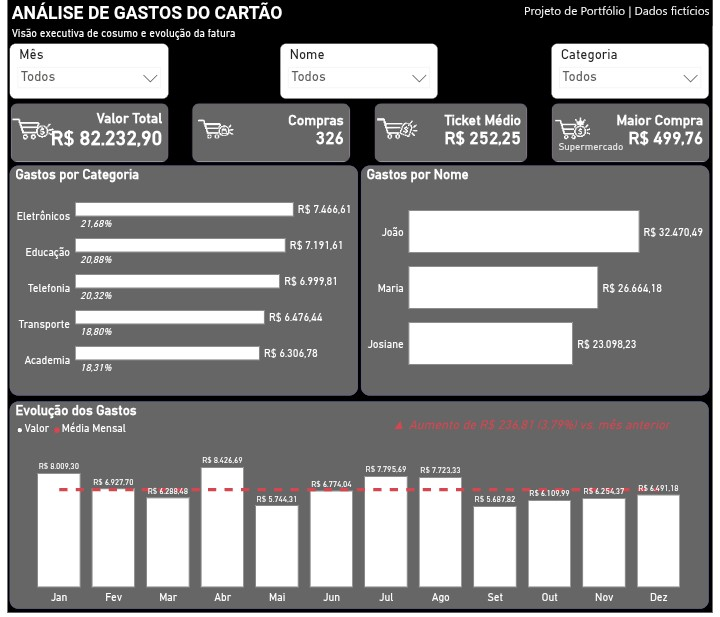

# 💳 Análise de Gastos do Cartão

Dashboard desenvolvido em Power BI para análise e acompanhamento dos gastos realizados no cartão de crédito.

O projeto apresenta uma visão consolidada das despesas, permitindo analisar a evolução dos gastos ao longo dos meses, categorias de consumo e distribuição das compras.

## 🎯 Objetivo

Desenvolver um painel de análise financeira capaz de transformar os dados da fatura do cartão em informações visuais para facilitar o acompanhamento dos gastos.

O dashboard permite analisar:

- Valor total das despesas
- Evolução dos gastos por mês
- Média de gastos mensais
- Distribuição dos gastos por categoria
- Gastos por pessoa
- Principais despesas
- Variação dos gastos ao longo do período

## 📊 Visão do Dashboard

### 01. Visão Geral

Visão consolidada dos principais indicadores de gastos do cartão.

## 🛠️ Tecnologias utilizadas

- Power BI
- DAX
- Power Query
- Excel

## 📁 Dados

Os dados utilizados no projeto são fictícios e foram estruturados exclusivamente para fins de demonstração e desenvolvimento do dashboard.

## 📌 Observação

Este projeto possui finalidade demonstrativa e faz parte do portfólio de projetos em Business Intelligence e Análise de Dados.

## 📁 Arquivo do projeto
O arquivo .pbix está disponível neste repositório para consulta e exploração do modelo desenvolvido no Power BI Desktop.
Dados: fictícios e utilizados exclusivamente para fins demonstrativos.
